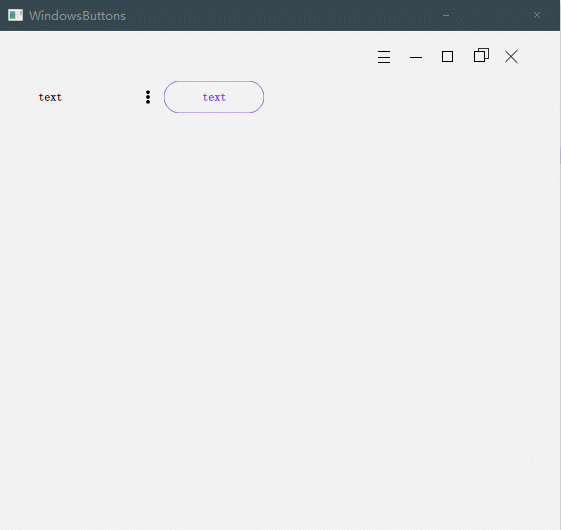

可交互的创意动态按钮
===

## 特点

- 所有颜色自定义
- 鼠标悬浮渐变
- 两种点击效果：鼠标点击渐变 / 水波纹动画（可多层波纹叠加）
- 额外鼠标移入/移出/按下/弹起的实时/延迟共8种事件
- 鼠标悬浮图标位置主动变化
- 鼠标拖动图标抖动反弹效果
- 鼠标进入父控件时开启出现效果，或启动时出现
- 延迟出现的动画效果（多个按钮连续）
- 记录开关状态
- 直接设置 x、y 的圆角显示
- 边框颜色设置
- 禁用时半透明+点击穿透效果
- 添加额外的边缘角标
- 三种前景模式：图标、文字、带遮罩的图标（任意变色）
- 支持QSS直接设置部分属性
- 与父类 QPushButton 兼容
- 时间准确性：根据时间戳计算动画进度，即使在低性能机器上也可准时完成动画
- 稳定性：一按钮多功能，完美兼容多种情况下焦点事件
- 极其强大的可扩展性，继承该按钮后可任意修改显示效果和动画效果


## 截图




## 用法

```C++
// 方框按钮
InteractiveButtonBase* btn = new InteractiveButtonBase("text", this);
btn->setGeometry(300, 300, 100, 100);
```

```C++
// 圆形按钮带图标，以及鼠标靠近(父控件悬浮)出现动画
icon_btn = new WaterCircleButton(QIcon(":/icons/point_menu"), this);
icon_btn->setGeometry(100, 50, 32, 32);
icon_btn->setShowAni(true); // 调用showForeground2时出现动画
```

```C++
// 自定义颜色按钮（遮罩效果）
InteractiveButtonBase* pixmap_btn = new InteractiveButtonBase(QPixmap(":/icons/point_menu"), this);
pixmap_btn->setGeometry(132, 50, 32, 32);
```

```C++
// 椭圆形按钮
InteractiveButtonBase* float_btn = new WaterFloatButton("text", this);
float_btn->setGeometry(164, 50, 100, 32);
float_btn->setBgColor(QColor(102,51,204,192), QColor(102,51,204,255));
```

```C++
// 自定义按钮（win最小化按钮）
WinMenuButton* menu_btn = new WinMenuButton(this);
menu_btn->setGeometry(368, 10, 32, 32);
```


## API

只说明一下常用的方法，具体可参考 `interactivebuttonbase.h`：

```C++
// 设置文本（同QPushButton）
void setText(QString text);

// 设置Icon
void setIcon(QIcon icon);

// 设置Pixmap，会根据 icon_color 自动变色
void setPixmap(QPixmap pixmap);

// 设置额外扩展的角标，比如右边扩展小箭头、右上角标签、左边图标等
virtual void setPaintAddin(QPixmap pixmap, Qt::Alignment align = Qt::AlignRight, QSize size = QSize(0, 0));

// 调整各种动画时长
void setHoverAniDuration(int d);
void setPressAniDuration(int d);
void setClickAniDuration(int d);
void setWaterAniDuration(int press, int release, int finish);
// 是否启用水波纹，false则改为渐变
void setWaterRipple(bool enable = true);
void setJitterAni(bool enable = true);

// 设置无交互时的背景颜色
void setBgColor(QColor bg);
// 设置hover和press两种状态的背景颜色，与背景叠加
// press会和hover以及默认背景再叠加
void setBgColor(QColor hover, QColor press);
// 单独设置各种颜色
void setNormalColor(QColor color);
void setBorderColor(QColor color);
void setHoverColor(QColor color);
void setPressColor(QColor color);

// 设置前景颜色
void setIconColor(QColor color = QColor(0, 0, 0));
void setTextColor(QColor color = QColor(0, 0, 0));
void setFocusBg(QColor color);
void setFocusBorder(QColor color);

// 设置字体大小
// 如果已设置 setTextDynamicSize(true)，那么会有改变动画
void setFontSize(int f);

// 前景对齐方式
void setAlign(Qt::Alignment a);

// 设置圆角
void setRadius(int r);
void setRadius(int rx, int ry);

// 设置边界宽度（默认0，透明）
void setBorderWidth(int x);

// 分别设置四周空白
void setPaddings(int l, int r, int t, int b);
// 设置水平、垂直空白
void setPaddings(int h, int v);
// 设置四周相同的空白
void setPaddings(int x);
// 设置图标边缘空白比例，0~0.5，越大越空
void setIconPaddingProper(double x);

// 设置鼠标交互时前景（文字/图标）会不会动
void setFixedForePos(bool f = true);
// 设置固定大小；并且会自动选取合适的最小值（adjustMinimumSize()）
void setFixedForeSize(bool f = true, int paddings = 0);
// 设置为正方形（以高度为准）
void setSquareSize();

// 修改字体时是否显示动画
void setTextDynamicSize(bool d = true);

// 设置鼠标单击松开后是否当做移开
// 点击出现菜单的按钮必须设置
void setLeaveAfterClick(bool l = true);

// 启用双击，会响应双击事件，但是单击会有延迟
void setDoubleClicked(bool e = true);

// 动画时是否自动设置文字的颜色，针对派生类的设置，不一定有效
void setAutoTextColor(bool a = true);

// 临时屏蔽hover事件，需要手动关闭（set true->操作->set false）
// 比如出现动画，如果一开始鼠标在按钮上，按钮移开，但是hover效果还在，直到鼠标动
void setBlockHover(bool b = true);

// 鼠标进入按钮区域，前景图标从对面方向缩放出现
void setShowAni(bool enable = true);
// 前景从中心点出现的缩放动画
void showForeground();
// 前景从该点对面出现的动画
void showForeground2(QPoint point = QPoint(0, 0));
// 隐藏前景，使用 showForeground() 恢复
void hideForeground();
// 延迟的 showForeground2()
void delayShowed(int msecond, QPoint point = QPoint(0, 0));

// 调整最小大小，很常用
void adjustMinimumSize();

void setState(bool s = true);
bool getState();

// 模拟鼠标点击效果，与鼠标点击作用一样
// 会触发 clicked 信号
virtual void simulateStatePress(bool s = true, bool a = false);

// 该点是否在按钮的范围内
virtual bool inArea(QPoint point);
```

信号：

```C++
void showAniFinished();
void hideAniFinished();
void pressAppearAniFinished();
void pressDisappearAniFinished();
void jitterAniFinished();

// 点击事件
void clicked();
void doubleClicked();
void rightClicked();

// 焦点
void signalFocusIn();
void signalFocusOut();

// 其余鼠标事件
void signalMouseEnter();
// 进入后延迟信号（以渐变动画完成为准，相当于可手动设置）
void signalMouseEnterLater();

void signalMouseLeave();
// 离开后延迟的信号（直至渐变动画完成（要是划过一下子离开，这个也会变快））
void signalMouseLeaveLater();

void signalMousePress(QMouseEvent *event);
void signalMousePressLater(QMouseEvent *event);

void signalMouseRelease(QMouseEvent *event);
void signalMouseReleaseLater(QMouseEvent *event);
```

